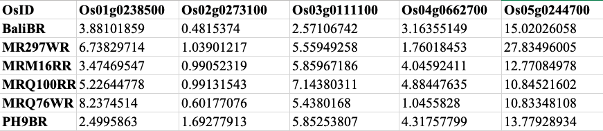

# thesis_scripts
**Scripts/source code used for PhD thesis project**

Contents

<ul class="toc_list">
<li><a href="#First_Point_Header">1 Clean Raw data</>
<li><a href="#Second_Point_Header">2 Mapping reads to reference genomes using bwa</a></li>
<li><a href="#Third_Point_Header">3 SNPs calling using GATK</a></li>
<li><a href="#Fourth_Point_Header">4 SNPs annotation using SnpEff</a></li>
<li><a href="#Fifth_Point_Header">5 SNPs filtering using R</a></li>
<li><a href="#Sixth_Point_Header">6 Mapping reads (transcriptome) to reference genome using bowtie2 & tophat2</a></li>
<li><a href="#Seventh_Point_Header">7 Transcripts assembly using Cufflinks</a></li>
 <li><a href="#Eighth_Point_Header">8 Total read counts from aligmet using HTSeq</a></li>
<li><a href="#Ninth_Point_Header">9 Genes co-expression network analysis</a></li>
</ul>

<h2 id="First_Point_Header">Clean Raw data</h2>
Raw data of genomes and transcriptomes have been deposited in ENA database (https://www.ebi.ac.uk/ena/browse) under these accessions number: 
<li>PRJEB29070 (Genomes of pigmented rice)</li>
<li>PRJEB32344 (Genomes of non-pigmented rice)</li>
<li>PRJEB34340 (Transcriptomes of pigmented and non-pigmented rice)</li>

<h2 id="Second_Point_Header">Mapping reads to reference genomes using bwa</h2>
Index the reference genome using bwa-index. Oryza japonica cv. Nipponbare was used as a reference genome. You can run this
command:
<pre style="color: silver; background: black;">bwa index nipponbare.fasta</pre>

You can map the paired-end reads using this command:
<pre style="color: silver; background: black;">sh genome_aln.sh</pre>

<h2 id="Third_Point_Header">SNPs calling using GATK</h2>
Post processing for mapped reads in SAM format is required before SNPs calling. You can run this command:
<pre style="color: silver; background: black;">sh snp_mining.sh</pre>
Post processing and SNPs calling from transcriptome mapped reads can be performed using this command:
<pre style="color: silver; background: black;">sh rna_snp_aln.sh</pre>

<h2 id="Fourth_Point_Header">SNPs annotation using SnpEff</h2>
SnpEff is one of the popular tools that used for SNPs annotation. But first, a reference gene annotation must be selected and index before the SNPs annotation processes. You can run SNPs annotation using this command:
<pre style="color: silver; background: black;">sh snp_annotation.sh</pre>

<h2 id="Fifth_Point_Header">SNPs filtering using R</h2>
Filtering your SNPs is crucial to obtain only the high quality SNPs for downstream analysis. Several criteria and parameters
have been performed by following the best practices from various publications. As the raw SNPs were in high-throughput data format, hence filtering SNPs using R is essential. File format conversion is also a routine task in SNPs analysis. R scripts also was used to convert the file format into format of interest. You can perform SNPs filtering and file format conversion by following this script:
<pre style="color: silver; background: black;">snp_filtering.R</pre>

<h2 id="Sixth_Point_Header">Mapping reads (transcriptome) to reference genome using bowtie2 & tophat2</h2>
Reference genome must be indexed before performing the reads mapping to reference genome. You can run this command to index the reference genome:
<pre style="color: silver; background: black;">bowtie-build nipponbare.fasta nipponbare</pre>
Reads mapping can be performed using tophat2. Make sure your genome index file in the same directory of fastq file. You can use this script to perform reads mapping:
<pre style="color: silver; background: black;">sh rna_aln.sh</pre>

<h2 id="Seventh_Point_Header">Transcripts assembly using Cufflinks</h2>
Transcripts assembly was performed using Cufflinks, which also can estimate transcripts abundance and then used for differential expression genes. The input data is the mapped RNA-seq reads in BAM format. You can run transcripts assembly using this command:
<pre style="color: silver; background: black;">sh cufflinks_assembly.sh</pre>

<h2 id="Eighth_Point_Header">Total read counts from aligmet using HTSeq</h2>
HTSeq is a tool for counting the reads that are successfully mapped to the genomes. Firstly, you need the genome features in gff format. It can be downloade using the following command:
<pre style="color: silver; background: black;">wget https://rapdb.dna.affrc.go.jp/download/archive/irgsp1/IRGSP-1.0_representative_2019-08-29.tar.gz</pre>

Unzip the GTF file, and you can use this command to run htseq-count programme:
<pre style="color: silver; background: black;">sh htseq_count.sh</pre>

<h2 id="Ninth_Point_Header">Genes co-expression network analysis</h2>
Genes co-expression network analysis measures the correlations between genes from genes expressions or microarray data. The correlation between genes can be measured using coefficient model such as Pearson's, Spearman and Mutual Information.
Firstly, the input data with gene expressions value (i.e. FPKM) must be formated as below:

